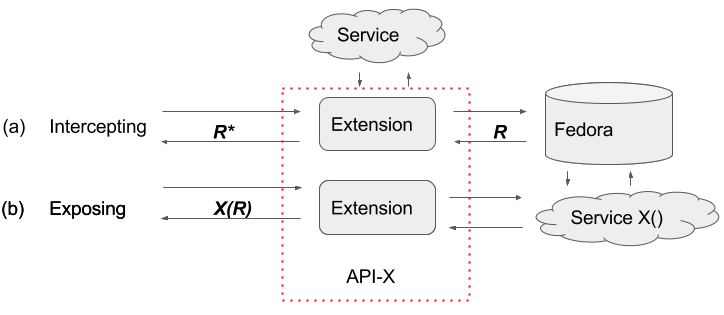
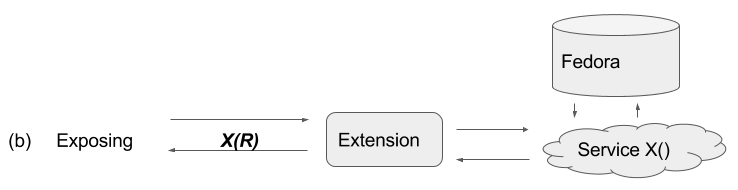
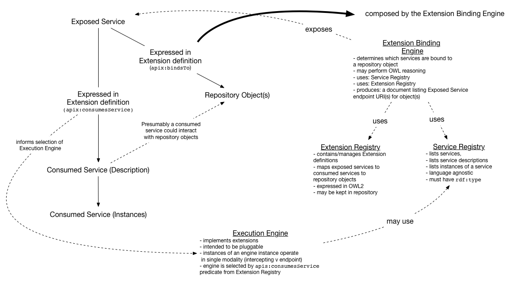

<h1><a id="top" href="#top" class="anchor">API-X Design Overview</a></h1>

* [Introduction](#introduction)
    * [Extending a repository](#extending-a-repository)
* [Modality](#modality)
    * [Intercepting](#intercepting)
    * [Exposing](#exposing)
* [Components](#components)
    * [Extension Binding Engine](#extension-binding-engine)
    * [Extension Registry](#extension-registry)
    * [Service Registry](#service-registry)
    * [Execution Engine](#execution-engine)
    * [Routing Engine](#routing-engine)
* [Workflow](#workflow)
* [Glossary](#glossary)
 
<h1><a id="introduction" href="#introduction" class="anchor">Introduction</a></h1>

API-X is a framework for binding services to repository objects in order to extend the functionality of a Fedora 4 repository.  It provides a data model for expressing how services bind to repository resources, registries that support service discovery, and an HTTP middleware layer that exposes services or their effects as web resources.

This document presents an overview of of the API-X framework design from a technical perspective. Please see the [API-X Overview][0] for a discussion of the high level purpose of API-X.

<h2><a id="extending-a-repository" href="#extending-a-repository" class="anchor">Extending a repository</a></h2>

The Fedora repository software provides a set of core responsibilities.  The Fedora community is codifying APIs that address these responsibilities as separate specifications:

* [CRUD][4] (based on LDP)
* [Versioning][5] (based on memento)
* [Messaging][6]
* [Authorization][7] (based on WebAC)
* [Transactions][8]
* [Fixity][9]

Functionality that lies outside these core concerns is considered out of scope for Fedora.  Nevertheless, there are often business concerns that are conceptualized as occurring at the repository layer, such as validation, import/export of packaged content, exposure of asynchronous storage APIs, and various other [use cases](https://wiki.duraspace.org/x/f5ApB).  

The community implementation of Fedora does not provide a formal extensibility mechanism, but it is possible to add features and re-package Fedora as a WAR file containing additional servlets, filters, or JAX-RS resources.  This approach to extending Fedora targets a particular software implementation.

API-X takes the approach of extending a repository in the HTTP layer.   This de-couples extensions from a particular software implementation of Fedora by aligning with HTTP API specifications only.  The API-X middleware layer serves as an HTTP proxy to the repository, providing a facade of the repository on the web.

<a id="fig1" href="#fig1">Figure 1</a>: Overview of API-X as an HTTP middleware to a a Fedora repository and associated services.  The [intercepting](#intercepting) and [exposing](#exposing) modalities are discussed in the next section.

<h1><a id="modality" href="#modality" class="anchor">Modality</a></h1>

The term ‘extension’ in API-X is used to describe the binding of services to repository resources in order to produce web resources.   The API-X supports two distinct modalities for extensions:  Intercepting and Exposing.

<h2><a id="intercepting" href="#intercepting" class="anchor">Intercepting</a></h2>

The API-X middleware serves as an HTTP proxy for repository resources (also known in [RFC 3040](https://www.ietf.org/rfc/rfc3040.txt) as a surrogate<a href="#sup1">1</a>).   As a proxy, API-X is deployed between a client and the repository.  All requests to repository resources must pass through the API-X middleware before being serviced by the repository.  

_Intercepting_ extensions leverage services to alter the contents of a request to repository resources, or alter the contents of a response from the repository.   In other words, an intercepting extension binds a service to a repository resource for the express purpose of modifying the way that repository resource is exposed as a web resource.

<a id="fig1a" href="#fig1a">Figure 1a</a>: Intercepting modality.  A fedora repository resource _R_ is exposed as _R*_ by the action of one or more extensions on the incoming request or outgoing response. 

The intercepting modality is illustrated in Figure 1a;  A Fedora repository resource _R_ is exposed as _R*_ on the web through API-X.  Notably:

* The URIs for _R_ and _R*_ are different, due to the nature of API-X as a reverse proxy. When using API-X, only the API-X URIs (and therefore _R*_) are exposed on the web.
* If multiple extensions bind to the same repository object in the intercepting pattern, the request and response will be routed through a pipeline of extensions.

<h2><a id="exposing" href="#exposign" class="anchor">Exposing</a></h2>

<a id="fig1b" href="#fig1b">Figure 1b</a>:  Exposing modality.  The action of a service _X_ on repository resource _R_ is exposed as resource _X(R)_.

_Exposing_ extensions provide URIs (endpoints) that invoke a service on a particular object in the repository and expose the results as a web resource.  Figure 1b illustrates this pattern.  For a given repository resource _R_, the result of invoking a service _X_ on _R_ is exposed as resource _X(R)_.
Each binding between a specific service and a specific object X(R) is instantiated as a web resource with a distinct URI.    For a given repository resource _R_, its representation via API-X _R*_ will contain links to all exposed services for the sake of discovery.

<h1><a id="components" href="#components" class="anchor">Components</a></h1>

In order to implement the intercepting and exposing extension modalities provided by API-X, several questions need to be answered, such as:

* How do we know that a particular extension is applicable to certain kinds of objects and not others?
* How to we keep track of the services available to extensions?
* What is the mechanism by which a particular service modifies a request or response?

This section provides an overview the internal design of the API-X middleware implementation, providing a list of components that address the various concerns relevant to implementing API-X modalities.  

<a id="fig2" href="#fig2">Figure 2</a> provides a brief overview summary of API-X components and how they interact.

<h2><a id="extension-binding-engine" href="#extension-binding-engine" class="anchor">Extension Binding Engine</a></h2>

See: [Extension Definition & Binding][1]

Extension binding is the act of determining if an extension is applicable to a given object in the repository.  API-X defines an [extension definition][10] model for describing the set of objects an extension can bind to, describing the modality of the extension, and describing the services consumed (and exposed, where applicable) by a given extension.  The extension binding engine examines extension definitions and determines if a given extension can bind to a given object.

The set of objects that can bind to an extension are described by OWL ontologies.  An extension definition names the class of resources that can be bound to an extension.   For a repository resource to bind to an extension, the resource must explicitly declare that it is a member of a matching class (e.g. simple matching of `rdf:type`), or class membership must be inferred via OWL reasoning.  The extension binding engine performs the necessary matching or reasoning in order to make this determination

<h2><a id="extension-registry" href="#extension-registry" class="anchor">Extension Registry</a></h2>

See: [Extension Definition & Binding][11]

The extension registry is simply a collection of extension definition documents applicable to a given instance of API-X.  The registry presents an API for adding or removing extension definitions from an API-X instance.  Implementations of the registry may use the Fedora repository itself as a durable persistence for extension definitions, and/or discover extension definitions represented as repository resources. 

<h2><a id="service-registry" href="#service-registry" class="anchor">Service Registry</a></h2>

See: [Service Discovery and Binding][2]

Service binding is the act of associating a specific instance of a service with its definition in a registry.  The service registry contains a list of services, their descriptions, and information about their instances.  Like the extension registry, the service registry provides an API for reading and writing service definitions, as well as registering and deregistering instances of services.  

Unlike extension definitions, API-X does not prescribe a specific ontology for describing services.  Several relevant standards do exist (like [SSWAP](http://bmcbioinformatics.biomedcentral.com/articles/10.1186/1471-2105-10-309#Fig2), [MSM](http://iserve.kmi.open.ac.uk/wiki/IServe_vocabulary)), and particular implementations of execution engines may place requirements on the content of descriptions for services they invoke.  At a minimum, however, API-X expects services to be named by an `rdf:type` that can be used to describe instances of such a service.

<h2><a id="execution-engine" href="#execution-engine" class="anchor">Execution Engine</a></h2>

See: [Execution Engines][12]

This component is responsible for invoking services in accordance with an extension’s modality.  The act of invoking a service and incorporating its response is highly dependent on the details of the service, the kind of data it expects in requests or responses, and the modality of the extension.  As such, the API-X architecture intends for the execution engine to be extensible.  The mechanism of extensibility (e.g. OSGi modules and service registry) is an implementation detail.

Execution engines planned for inclusion in the initial implementation of API-X include:

* Endpoint Proxy (exposing) - Blindly proxies request to some http endpoint.  Places Fedora resource URI in a header.
* Filter (intercepting) - Blindly sends request to a service.  Terminates if response is an error code.
* Transformation Proxy (intercepting) - Blindly sends a request to a service, forwards the response.  
* Camel (intercepting, exposing) - Forward client request as a message to a camel route that integrates with the extension’s consumed service.  The camel route is responsible for invoking the service, and formulating a response (exposing) or modifying a request/response (intercepting) as appropriate.

See [API-X design: Execution][3] for more information.

<h2><a id="routing-engine" href="#routing-engine" class="anchor">Routing Engine</a></h2>
 
The routing engine accepts requests from a client, and determines how that request is serviced.  It needs to:

* Determine if a request is for a repository resource or for an exposed service.
* Consult the service binding engine to see if any extensions apply.
* Inspect the extension definition (in particular apix:consumesService) to determine which execution engine can service the request.
* Send the request to the appropriate execution engine.

<h1><a id="workflow" href="#workflow" class="anchor">Workflow</a></h1>

Putting it all together, the API-X implementation components interact to create a workflow depicted in <a id="fig3" href="#fig3">Figure 3</a>:

To briefly describe this workflow:

1. Http request is received from the user (GET, POST, PUT, OPTIONS, etc)
1. Routing Engine: inspects the request
    * Look at URI.  Is this a request to Fedora resource?  Service exposed by resource?
    * Ask extension binding engine - are any extensions relevant to the request?  What services do they consume and/or expose?
1. Extension Binding Engine: performs type matching or OWL reasoning in order to determine which extensions match the given resource.
1. Routing Engine: Find matching execution engine implementation and send request based on extension definitions matched by extension binding, and extension modality
1. Execution engine:  Engage service binding to obtain an instance of a service, mediate relationship between request and service. 
1. Service: process data sent to it (possibly engaging other services) produce a response
1. Execution Engine: incorporate response in a manner appropriate to implementation
1. Routing engine:  Return response to user

<h1><a id="glossary" href="#glossary" class="anchor">Glossary</a></h1>

**Expose** - Provide a URI, possibly contextualized to repository objects, which provides access to a service.

**Extension** - Relates Services to Repository objects.  May expose a service on repository resources (‘exposing’ modality), or modify request or responses to repository objects (‘intercepting’ modality).

**Extension Binding** - The act of determining if an extension pertains to a given repository object.

**Extension Definition** - Contains criteria which indicate if a particular extension pertains to a given repository object, and a description of the services that are consumed or exposed by the extension.

**Service** - The abstract notion of a web resource accessed through HTTP or using HTTP message semantics.  Services may have a prescribed representation or interaction model, or protocol (e.g. REST, SOAP, SSWAP, etc).  Specific instances of services are addressed by URIs.

**Service Binding** - The act of associating a specific instance of a service with its definition in a registry.

---

<a id="sup1" href="#sup1">1</a>: “A gateway co-located with an origin server, or at a different point in the network, delegated the authority to operate on behalf of, and typically working in close co-operation with, one or more origin servers”

[0]: https://docs.google.com/document/d/1XzkD6OZOrEblBjsWXuWuzwPSgvgfv7igQlBSbGAo-Ls/edit?usp=sharing "API-X Overview" 
[1]: ./extension-definition-and-binding.md "Extension Definition & Binding" 
[2]: ./service-discovery-and-binding.md "Service Discovery & Binding" 
[3]: ./execution-and-routing.md "Execution & Routing" 
[4]: https://docs.google.com/document/d/1ad3MhTQWGof0IJ03yY5jVofCK8uO9yPKMVXVYq7a44o/edit "F4 Spec - CRUD"
[5]: https://docs.google.com/document/d/1wpEVG3fNUYWNSmNdNIwTHEujhg-CAQf3hLKszfjpNO4/edit "F4 Spec - Versioning"
[6]: https://docs.google.com/document/d/1fQOUJE0-QjlbGhDRs1fknj-rDuUeAZ9kVSxg9ETdn_I/edit "F4 Spec - Messaging"
[7]: https://docs.google.com/document/d/1LTIWq5KdH0uAbzZJKR7h0JgnBwfmdbyJGcSdeb-4i8A/edit "F4 Spec - Authorization"
[8]: https://docs.google.com/document/d/1Ij4lFomcOJuOiWptZPyhP_wBRtxbqBP3_Rdw1eKmClM/edit "F4 Spec - Transactions"
[9]: https://docs.google.com/document/d/1ws1x7bry3RqB305XxtqIgru5c8heTDDk03jkbCA7iW4/edit "F4 Spec - Fixity"
[10]: ./extension-definition-and-binding.md#extension-definition-ontology "Extension Definition Ontology - Extension Definition & Binding"
[11]: ./extension-definition-and-binding.md#extension-registry-and-api "Extension Registry and API - Extension Definition & Binding"
[12]: ./execution-and-routing.md#execution-engines "Execution Engines - Execution & Routing"